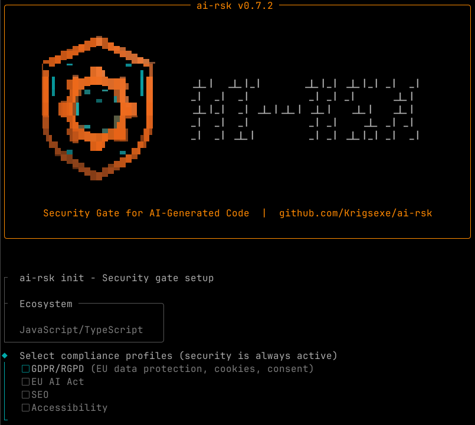

<p align="center">
  
</p>

<p align="center">
  <strong>ai-rsk - Security gate for AI-generated code</strong>
</p>

<p align="center">
  <a href="https://opensource.org/licenses/MIT"></a>
  <a href="https://github.com/Krigsexe/ai-rsk/releases"></a>
  <a href="https://crates.io/crates/ai-rsk"></a>
</p>

<p align="center">
  <a href="#installation">Install</a> &bull;
  <a href="#quick-start">Quick Start</a> &bull;
  <a href="#what-it-detects">What it Detects</a> &bull;
  <a href="ARCHITECTURE.md">Architecture</a> &bull;
  <a href="CONTRIBUTING.md">Contributing</a>
</p>

---
<p align="center">
  <a href="https://github.com/Krigsexe/ai-rsk">
    
  </a>
</p>

ai-rsk blocks your build until security issues are fixed. One Rust binary. 67 built-in rules. 5 compliance profiles (security, GDPR, AI Act, SEO, accessibility). Tree-sitter AST filter for context-aware detection. Auto-installs and manages external security tools (Semgrep, Gitleaks, osv-scanner, knip). Your AI can't deploy insecure code because the build won't pass.

## The Problem

LLMs generate functional code, but with recurring security flaws:

```javascript
// LLM writes this - it works, it's insecure
localStorage.setItem('access_token', response.data.token);
fetch('/api/data', { headers: { Authorization: `Bearer ${token}` } });
app.use(cors());
app.use(express.json());
// No helmet, no CSP, no rate limiting, no input validation
```

Non-developers who build with AI ship these patterns to production. Real users' emails, passwords, and payment data become accessible to anyone who knows where to look.

ai-rsk makes this impossible. The build doesn't pass. The LLM is forced to fix the code.

## What Happens When You Run It

```
$ ai-rsk scan --all

ai-rsk vX.X.X - Security Gate + Project Analysis
===================================================
  Profiles: security, gdpr, ai-act, seo, a11y
  Ecosystems: JavaScript/TypeScript
  ✓ semgrep 1.156.0
  ✓ gitleaks 8.30.0
  ✓ osv-scanner 2.3.3
  ✓ knip 5.88.1
===================================================

  [1/3] Running external tools...
  [2/3] Scanning 67 rules...
  [3/3] Analyzing project structure...

[BLOCK] Token stored in localStorage - accessible to any XSS attack.
  File: src/auth.js:42
  Rule: TOKEN_IN_LOCALSTORAGE
  Ref:  CWE-922 (https://cwe.mitre.org/data/definitions/922.html)
  Code: localStorage.setItem('access_token', response.data.token)
  Fix:  Move token to HttpOnly cookie server-side.

[WARN] CORS allows any origin - any website can call your API.
  File: src/app.js:12
  Rule: CORS_WILDCARD
  Ref:  CWE-942 (https://cwe.mitre.org/data/definitions/942.html)
  Code: app.use(cors());
  Fix:  Restrict CORS to specific trusted origins.

[ADVISE] No privacy policy page found.
[ADVISE] No robots.txt file found.

===================================================
Security Score: 55/100
Result: BLOCKED (2B 2W 3A)
Exit code: 1
===================================================

  Next: Fix the 2 BLOCK findings first - the build is blocked until they are resolved.
  Then address the 2 WARNs (they become BLOCK with --strict).
  After fixing, run ai-rsk scan to verify.
```

The LLM reads this output, fixes every issue, and re-runs the build. It can't skip anything - exit code 1 means the build fails.

## Installation

### Pre-built binaries (recommended)

Download from [Releases](https://github.com/Krigsexe/ai-rsk/releases):

| Platform | File |
|----------|------|
| macOS (Apple Silicon) | `ai-rsk-aarch64-apple-darwin.tar.gz` |
| macOS (Intel) | `ai-rsk-x86_64-apple-darwin.tar.gz` |
| Linux (x64) | `ai-rsk-x86_64-unknown-linux-musl.tar.gz` |
| Linux (ARM64) | `ai-rsk-aarch64-unknown-linux-gnu.tar.gz` |
| Windows (x64) | `ai-rsk-x86_64-pc-windows-msvc.zip` |

```bash
# Linux/macOS example:
tar -xzf ai-rsk-x86_64-unknown-linux-musl.tar.gz
sudo mv ai-rsk /usr/local/bin/

# Windows: extract the zip, add ai-rsk.exe to your PATH
```

### From crates.io

```bash
cargo install ai-rsk
```

### From source (requires Rust 1.85+)

```bash
cargo install --git https://github.com/Krigsexe/ai-rsk
```

### Verify

```bash
ai-rsk --version
ai-rsk --help  # Quick start guide with examples
```

## Quick Start

### 1. Initialize your project

```bash
cd /your/project
ai-rsk init
```

<p align="center">
  
</p>

This presents an interactive setup where you choose:
- **Compliance profiles**: GDPR/RGPD, EU AI Act, SEO, Accessibility (security is always active)
- **Environment mode**: Development, Production, or Auto
- **Region**: EU region auto-activates GDPR

It generates:
- `ai-rsk.config.yaml` with your selections
- `SECURITY_RULES.md` - contract between ai-rsk and the LLM (adapts to selected profiles)
- LLM discipline files for 16 AI coding tools (Claude Code, Cursor, Copilot, Windsurf, Cline, Gemini CLI, Codex CLI, Aider, Roo, Kiro, Continue, JetBrains AI, Amazon Q, Tabnine, Augment, Zed)
- Git hooks (pre-commit blocks insecure commits, pre-push blocks force-push to protected branches)
- Prebuild hook in `package.json` (JS/TS projects)
- `.gitignore` entry for `.ai-rsk/` report directory

Non-interactive mode (CI/piped input) uses sensible defaults automatically.

### 2. Scan

```bash
ai-rsk                # Scan current directory (no subcommand needed)
ai-rsk scan --strict  # Block on warnings too
ai-rsk scan --full    # Block on everything (recommended for AI-built projects)
ai-rsk scan --gdpr    # Add GDPR/RGPD compliance checks
ai-rsk scan --ai-act  # Add EU AI Act compliance checks
ai-rsk scan --seo     # Add SEO checks (robots.txt, sitemap, meta viewport)
ai-rsk scan --a11y    # Add accessibility checks (WCAG 2.2)
ai-rsk scan --all     # Enable ALL profiles
ai-rsk scan --json    # JSON output for CI/CD integration
```

### 3. Fix and re-scan

The output tells the LLM exactly what to fix, with code examples. Fix, re-run, repeat until exit code 0.

## What it Detects

### Layer 1 - 67 Built-in Rules (offline, deterministic, AST-filtered)

Patterns that LLMs generate repeatedly and existing tools miss. Tree-sitter AST filter eliminates false positives in comments and docstrings.

| Profile | Category | Rules | Examples |
|---------|----------|-------|---------|
| **security** | Token/Secret exposure | 5 | Token in localStorage, Bearer in client code, hardcoded secrets |
| **security** | Missing security headers | 8 | No helmet, no CSP, no HSTS, no X-Frame, no Referrer-Policy, no Permissions-Policy |
| **security** | Authentication flaws | 4 | Client-side auth only, missing rate limiting, WebSocket without auth, unprotected API routes |
| **security** | Cookie misconfiguration | 3 | Missing HttpOnly, Secure, SameSite flags |
| **security** | Input/Output | 5 | eval(), CORS wildcard, SSRF, XSS via dangerouslySetInnerHTML, path traversal |
| **security** | Business logic | 3 | Negative price, SELECT * in response, prompt injection |
| **security** | Django | 4 | DEBUG=True, SECRET_KEY hardcoded, ALLOWED_HOSTS wildcard, missing CSRF middleware |
| **security** | Flask | 1 | app.run(debug=True) enables RCE via Werkzeug debugger |
| **security** | Python general | 7 | requests no timeout, os.system, marshal.load, shelve.open, SQL f-string, JWT no verify, eval(input) |
| **security** | Python (existing) | 3 | pickle.load (RCE), yaml.unsafe_load (RCE), subprocess shell=True (command injection) |
| **security** | Go | 2 | text/template for HTML (XSS), http.ListenAndServe without timeout (slowloris) |
| **security** | Infrastructure | 4 | Source maps in prod, body parser no limit, unvalidated redirects, weak hash |
| **security** | Third-party | 2 | CDN scripts without SRI, Stripe webhooks without signature |
| **gdpr** | Privacy | 2 | Tracking without consent (gtag/fbq), PII in localStorage |
| **ai-act** | AI compliance | 4 | AI output not labeled, system prompt in client, LLM call without audit log, no token limit |
| **a11y** | Accessibility | 3 | img without alt, html without lang, form input without label |

Every rule has a CWE reference verified on [cwe.mitre.org](https://cwe.mitre.org/).
Rules are activated by profiles — `--gdpr`, `--ai-act`, `--a11y` enable their respective rules. Security rules are always active.

### Layer 2 - External Tools (auto-installed)

| Tool | What it does | Why it matters |
|------|-------------|----------------|
| **[Semgrep](https://semgrep.dev/)** | Static analysis, 1000+ rules, 30+ languages | Catches SQL injection, XSS, SSRF, insecure crypto |
| **[Gitleaks](https://github.com/gitleaks/gitleaks)** | Secret detection in code and git history | API keys, passwords, tokens accidentally committed |
| **[osv-scanner](https://google.github.io/osv-scanner/)** | Known CVE in dependencies | Vulnerable packages that need updating |

These are **automatically installed** if missing. ai-rsk manages their versions and updates.

### Layer 3 - Project Analysis (18 checks)

| Profile | Check | Type | What it detects |
|---------|-------|------|-----------------|
| always | Missing tests | ADVISE | No test framework, no test files |
| always | Missing CI/CD | ADVISE | No pipeline = security gates can be bypassed |
| always | Dead dependencies | ADVISE | Installed but never imported |
| always | Deprecated packages | ADVISE | `request`, `moment`, etc. |
| always | No console.log stripping | WARN | Console statements leak to production |
| always | Duplicate HTTP clients | ADVISE | `axios` + `node-fetch` + `got` in same project |
| always | Tamper detection | BLOCK | `ai-rsk scan \|\| true`, `--no-verify` in CI |
| always | No lockfile | WARN | No package-lock.json, Cargo.lock, go.sum |
| always | .env not gitignored | BLOCK | Secrets will be committed to git |
| always | Dockerfile root user | WARN | Container runs as root — no USER directive |
| gdpr | No cookie banner | WARN | Tracking scripts without CMP |
| gdpr | No privacy page | ADVISE | No /privacy or /politique-de-confidentialite |
| seo | No robots.txt | ADVISE | Search engines can't find crawl rules |
| seo | robots.txt exposes sensitive paths | WARN | /admin, /api in Disallow reveals existence |
| seo | No sitemap | ADVISE | Search engines miss pages |
| seo | No meta viewport | ADVISE | Mobile rendering broken |
| seo | No canonical URLs | ADVISE | Duplicate content in search results |

## Severity Levels

| Flag | BLOCK | WARN | ADVISE | Best for |
|------|-------|------|--------|----------|
| `ai-rsk scan` | exit 1 | exit 0 | exit 0 | Senior devs who want security only |
| `ai-rsk scan --strict` | exit 1 | exit 1 | exit 0 | Teams with defense-in-depth |
| `ai-rsk scan --full` | exit 1 | exit 1 | exit 1 | AI-built projects - LLM can't ignore anything |

## Integration

### npm / pnpm / yarn / bun

```json
{
  "scripts": {
    "prebuild": "ai-rsk scan --strict",
    "build": "vite build"
  }
}
```

`prebuild` runs automatically before `build`. Exit code 1 = build stops.

### CI/CD (GitHub Actions)

```yaml
jobs:
  security:
    runs-on: ubuntu-latest
    steps:
      - uses: actions/checkout@v4
      - name: Install ai-rsk
        run: |
          wget -qO- https://github.com/Krigsexe/ai-rsk/releases/latest/download/ai-rsk-x86_64-unknown-linux-musl.tar.gz | tar xz -C /usr/local/bin/
      - name: Security gate
        run: ai-rsk scan --strict
```

Or with Cargo (if Rust is already in your CI):

```yaml
      - name: Install ai-rsk (from source)
        run: cargo install --git https://github.com/Krigsexe/ai-rsk
```

### Docker (multi-stage)

```dockerfile
# Build stage - ai-rsk scans here
FROM node:20-alpine AS builder
# Download pre-built binary (no Rust needed)
RUN wget -qO- https://github.com/Krigsexe/ai-rsk/releases/latest/download/ai-rsk-x86_64-unknown-linux-musl.tar.gz | tar xz -C /usr/local/bin/
WORKDIR /app
COPY . .
RUN ai-rsk scan --strict
RUN npm ci && npm run build

# Production stage - ai-rsk is NOT here (dev tool only)
FROM node:20-alpine
COPY --from=builder /app/dist /app/dist
CMD ["node", "dist/server.js"]
```

## False Positive Handling

```javascript
// ai-rsk-ignore TOKEN_IN_LOCALSTORAGE -- stores UI theme preference, not an auth token
localStorage.setItem('auth_theme_token', 'dark');
```

Rules:
- Comment must be on the **line before** the flagged code
- Justification after `--` is **mandatory** (ignore without reason = still flagged)
- Total ignore count is displayed in the report

## Supported Ecosystems

| Ecosystem | Detection | Layer 1 Rules | Layer 2 Tools | Layer 3 Analysis |
|-----------|-----------|---------------|---------------|------------------|
| JavaScript/TypeScript | `package.json` | 39 rules | Semgrep + Gitleaks + osv-scanner + knip | Full (dead deps, console strip, HTTP clients, prebuild) |
| Python | `requirements.txt`, `pyproject.toml`, `setup.cfg`, `Pipfile`, `requirements/` | 16 rules (Django, Flask, requests, os.system, marshal, shelve, SQL f-string, JWT, eval, pickle, yaml, subprocess, exec) | Semgrep + Gitleaks + osv-scanner | Tests + CI |
| Go | `go.mod` | 2 rules (text/template XSS, http timeout) | Semgrep + Gitleaks + osv-scanner | Tests + CI |
| Rust | `Cargo.toml` | Ecosystem-specific discipline | Semgrep + Gitleaks + osv-scanner + cargo-audit | Tests + CI |
| HTML | `*.html` files | 5 rules (img alt, html lang, form label, CDN SRI, window.opener) | Semgrep | SEO checks (robots, sitemap, viewport, canonical) |

## Compliance Profiles

ai-rsk goes beyond security with compliance profiles that you select during `ai-rsk init`:

| Profile | Flag | What it enforces |
|---------|------|------------------|
| **security** | always active | OWASP Top 10, CWE Top 25, security headers, auth, crypto, input validation |
| **gdpr** | `--gdpr` | RGPD/GDPR: cookie consent, tracking scripts, PII in storage, privacy page |
| **ai-act** | `--ai-act` | EU AI Act Art. 50 + Cyber Resilience Act: AI output labeling, system prompt protection, audit logs, token limits |
| **seo** | `--seo` | robots.txt, sitemap.xml, meta viewport, canonical URLs |
| **a11y** | `--a11y` | WCAG 2.2 Level A: img alt, html lang, form labels |

Profiles can be set in `ai-rsk.config.yaml`:

```yaml
profiles:
  - "security"
  - "gdpr"
  - "ai-act"
region: "eu"  # Automatically activates gdpr
mode: "production"  # Filters mode-specific rules
```

Or via CLI flags: `ai-rsk scan --gdpr --ai-act`

Or all at once: `ai-rsk scan --all`

## Configuration

`ai-rsk.config.yaml` at your project root:

```yaml
# Compliance profiles (security is always active)
profiles:
  - "security"
  - "gdpr"

# Environment mode (development/production)
mode: "production"

# Region hint (eu = GDPR automatically active)
region: "eu"

# Timeout for external tools (seconds)
tool_timeout_seconds: 120

# Disable rules with mandatory justification
disabled_rules:
  - id: MISSING_CSP
    reason: "CSP is handled by Cloudflare, not in app code"

# Additional paths to exclude from scanning
exclude:
  - "generated/"
  - "migrations/"
```

Unknown fields are rejected — typos in config are caught immediately.

## Why Not Just Use Semgrep?

Semgrep is excellent. ai-rsk uses it. But Semgrep alone doesn't:
- **Force installation** - LLMs skip optional tools
- **Detect absence** - "no helmet" is not a pattern Semgrep finds
- **Block the build** - Semgrep findings don't stop `npm run build`
- **Generate LLM discipline files** - Semgrep doesn't tell your AI coding tool how to behave
- **Analyze project structure** - missing tests, dead deps, no CI

ai-rsk is the orchestrator. Semgrep is one of its tools.

## Philosophy

> There's no such thing as "discipline" with AI. It's about **imposition**.
>
> An LLM will always try to work around the problem to deliver what the user asked for as fast as possible. Security is a brake on that objective - so the LLM will ignore it, work around it, or minimize it.
>
> Every security rule must be **imposed** by a technical mechanism (exit code 1, blocked build, CI that refuses to merge). Advice in stdout is necessary but **insufficient** - only the exit code forces action.

## License

MIT - [Julien GELEE](mailto:julien.gelee@proton.me)

## Support

If ai-rsk helps you ship secure code, consider supporting the project:
- Star this repo
- Report false positives and false negatives
- Contribute rules
- [Fueling my open source work with coffee](https://github.com/sponsors/Krigsexe) 
